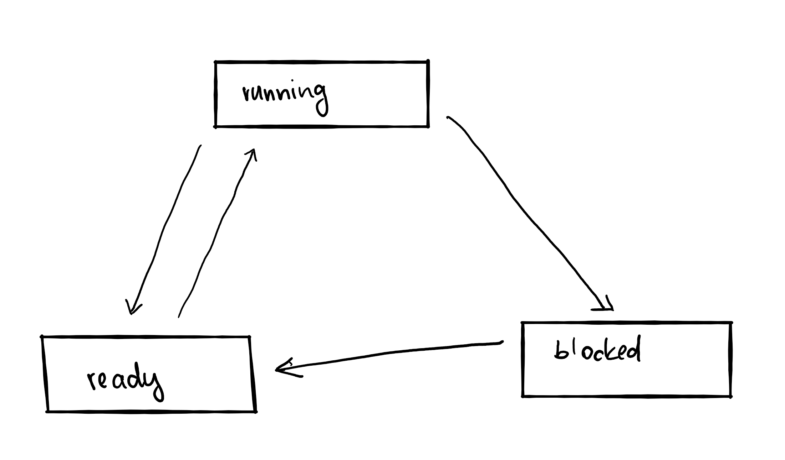
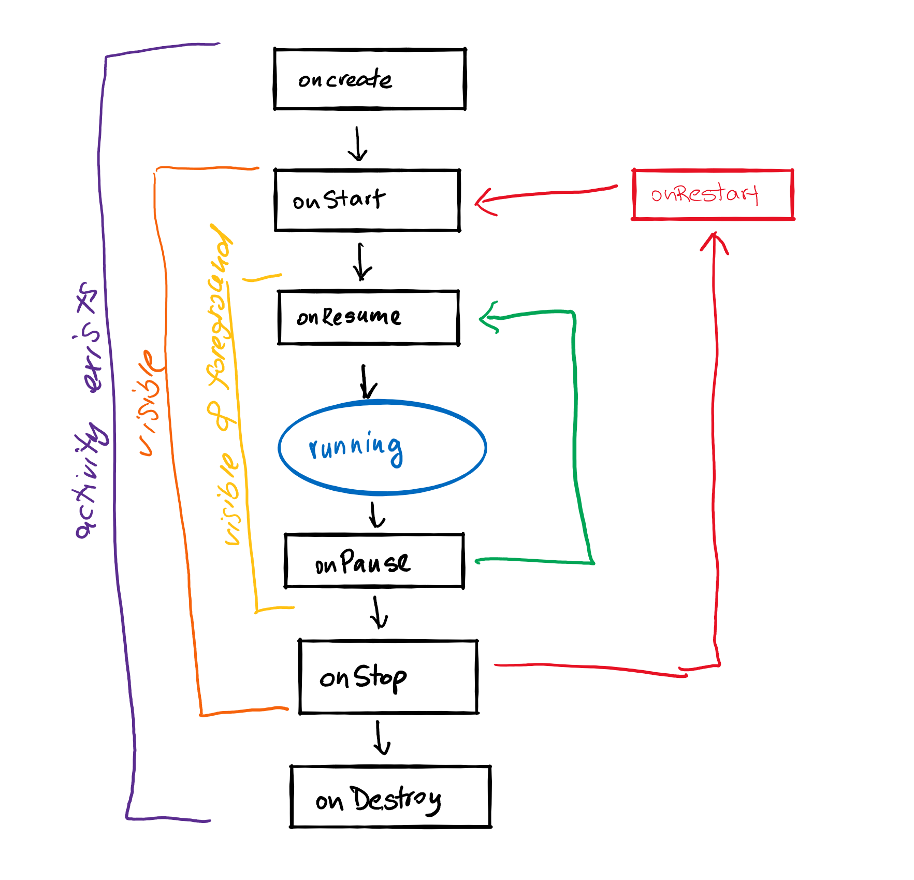
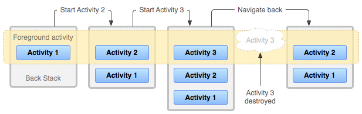
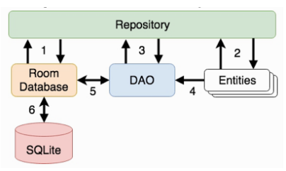

# Exam preparation questions

## 1. Programming platforms

### 1.1 Why do we have different programming platforms (as opposed to a single general purpose platform)?

Platform is environment in which software application is executed. Environment defines hardware and softaware. Due to different use cases (e.g. sensing temperature on Antarctica, calculating mass of black hole, self-driving cars) there is need to have different properties of hardware (low-power with long lasting battery, high-power supercomputers, systems with quick response time to interupts, etc.) with different programme paradigms in which software is written. With this in mind there is no way to have single general purpose platform with which all this paradigms could be implemented (e.g. you cannot build low-powered microcontroller on the same platforms as supercomputers).

### 1.2 List at least two platforms and describe the key properties of each

| Platform         | Key properties                                                                                                                                                                                                                  |
| ---------------- | ------------------------------------------------------------------------------------------------------------------------------------------------------------------------------------------------------------------------------- |
| Web platform     | Depends on network properties (speed, availability), multi-tier stateless architecture (server-client)                                                                                                                          |
| Mobile platform  | Multitasking devices with high energy constraint (most of the time we depend on battery usage), portable, a lot of sensors and user iteractions, wireless connectivity, background processing is limited                        |
| Embedded systems | Biggest computer platforms (98%), very constrained systems (energy, autonomous operation, real-time operation), most of the time are small and low-power devices that only do one thing (e.g. sensing temperature on Antartica) |
| Gaming platforms | High-power platform with lot of GPU cores that enables high quality graphic output                                                                                                                                              |

## 2. Web platforms

### 2.1 Briefly describe the underlying technologies supporting the Web platform

**HTTP** (HyperText Transfer Protocol) is stateless protocol based on request-response (server-client) implementation. Client requests some data from server which response to request. Requests are based on HTTP methods like GET, POST, DELETE, PUT,etc. HTTPS is HTTP protocol upgraded with encrypted communication.

**REST** (Representational State Transfer) is stateless protocol for sending data between server and client over HTTP(S) connection. Server and client are black boxes to each other - they "talk" over uniform interfaces.

**URL** (uniform resource locators) is protocol used for resource locators on web, they are translated to IP addresses using **DNS** (domain name system).

### 2.2 What is Hypertext? Briefly describe its historical role in the Web.

Hypertext is type of text document with ability to hold references to same or other documents that can be _immediately_ accessed, most of the time it is written in HTML (hypertext markup language).

In 1989 Tim Berners-Lee joins hypertext with internet to create the World Wide Web.

### 2.3 What is WWW? List its main components.

WWW is global information space in which storage is implemented via **web servers**, hypertext (documents with references) are written in **HTML** and communication is done over **internet** with client-server protocol **HTTP** (Hyper Transfer Protocol).

### 2.4 Describe the functioning of HTTP.

HTTP is stateless protocol based on request-response implementation between client and server. Client requests data from server using one of HTTP methods (GET, POST, PUT, DELETE, etc.) and to that server responds with requested data. HTTPS is upgraded version of HTTP with encrypted communication.

### 2.5 What does HTTP response code 200 mean?

HTTP response code means "OK". Server sends code 200 with response data, when requested data is available.

### 2.6 Explain the difference between a single-tier and a multi-tier Web architecture.

In multi-tier architecture presentation, business logic and data are seperated in different layers which enables easier scalling and upgrading. In single-tier architecture there is no separation - presentation, logic and data are all in the same layer.

### 2.7 List main functionalities of each: Presentation layer, Application/Business layer, Data layer in a multi-tier Web architecture.

| Layer                                |                                                                   |
| ------------------------------------ | ----------------------------------------------------------------- |
| Presentation layer (frontend)        | dealing with UI and user iteractions, written in HTML, JS, CSS    |
| Application/Business layer (backend) | dealing with application logic, data fetching, processing         |
| Data layer                           | dealing with data storage and organization, SQL or NoSQL database |

### 2.8 In his 1996 article, Tim Berners Lee expresses a concern that the Web looks like a lot of television channels. Explain what he means by this? In your opinion, is the Internet today still "a lot of television channels"? Defend your argument.

### 2.9 Changing URLs were a problem in the early Web. How is it solved nowadays?

Today URLs are automatically translated to IP address using DNS (domain name system). Owner of URL has to register its URL with registrator which then handles DNS servers and updates them.

### 2.10 What are content-delivery networks? How do they help with the network load?

Content-delivery network or network distribution network (CDN) is geographically distributed network of proxy servers and data centers. It provides quicker respondes to client requests because they are physical closer to end user then main server.

### 2.11 Explain how AJAX web pages work.

AJAX (Asynchronous JavaScript and XML) is set of web development techniques that creates asynchronous web application. With AJAX, websites can send and retreive data from server asynchronous (in the background) with no effect to website itself.

By decoupling data layer from presentation, Ajax allows web pages to change content dynamically without need to reload entire web page.

### 2.12 What is Information-centric networking?

Information-centric networking (ICN) is an approach to evolve the Internet infrastructure away from a host-centric paradigm, based on perpetual connectivity and the end-to-end principle, to a network architecture in which the focal point is identified information (or content or data). In this paradigm, connectivity may well be intermittent, end-host and in-network storage can be capitalized upon transparently, as bits in the network and on data storage devices have exactly the same value, mobility and multi access are the norm and anycast, multicast, and broadcast are natively supported. Data becomes independent from location, application, storage, and means of transportation, enabling in-network caching and replication. The expected benefits are improved efficiency, better scalability with respect to information/bandwidth demand and better robustness in challenging communication scenarios. In Information-centric networking the cache is a network level solution, and it has rapidly changing cache states, higher request arrival rates and smaller cache sizes. In particular, information-centric networking caching policies should be fast and lightweight.

### 2.13 What is REST? List its main rules?

- client-server model: black box to each other
- statelesness: server don't track state of client
- cacheability
- layered system
- uniform interaface

### 2.14 Describe constraints of REST and MEAN.

Main constraint of REST is statelesness, client needs to send context each time. In practise developers implements their own solution (with adding headers for example).

Main constraint of MEAN architecture (Mongo, Express, Angular, Node.js) is that MongoDB is NoSQL database that supports BASE transactions and that Express server is written in JavaScript that runs only on one thread.

### 2.15 Why does TCP work poorly over slow links (such as satellites)?

### 2.16 Why is HTTP often not used for low-resource devices in the Internet of Things?

HTTP adds overhead that needs to be processed before requesting or receiving data. If device is low-resource it may not be able process information in time. Internet of Things devices often process real-time data which are not usable in long period of time.

## 3. Mobile platforms

### 3.1 List at least four applications of mobile computing technology (note: don’t list specific applications, but application areas)

- Personal assistents
- Sport tracking apps
- Tools (flashlight, measures)
- Media apps (media players)
- Games
- Business apps
- ...

### 3.2 Present some arguments about why you think that Symbian operating system failed to reach the popularity of Android or iOS.

One could argue that it did :)

- very resource efficient
- not customized for touch screen support
- no central app developing platform/store
- anyone could change source code witout guidelance (like Google's in Android)

### 3.3 What is Android? (max 3 sentences)

Android platform is bundle of Android mobile OS, Android libraries (androidx, support libraries), application frameworks and key apps. It is most popular mobile platform in 2020, it is open source but with centralized guidelance by Google. Key features are tailored for battery-powered and low-memory devices, it has support for direct manipulation interfaces and open ecosystem for applications.

### 3.4 What are the key affordances of the mobile platform?

- tailored for battery-powered devices
- tailored for low-memory devices
- supports mobile sensors and are energy efficient

### 3.5 What are the main constraints of the mobile platform?

- energy - most of the time devices are battery-powered
- processing contraints - background processing is limited due to energy savings
- uninform user experience
- wireless constraints
- context sensing (errors due to small space)
- security & privacy

### 3.6 What should we be careful about when designing user interaction for a mobile application?

Mobile systems often has small displays so we have to design UI that it is not to crouded with information and UI "blocks". When writing Android applications we have to keep in mind to support diverse screen sizes and dimensions, different powered devices (low-budget to high-end devices), network capabilities (mobile network is metered, 3G/4G is not worldwide availbable), etc.

### 3.7 Discuss ability to troubleshoot and upgrade software built and deployed in: 1) Android phones; 2) microwave ovens.

**Android applications**: Android Studio (official IDE for building Android apps) has a lot of build in debugging tools that enables in-dept view of data stored in memory, step-by-step debuging, emulator support, etc. Software can be upgradded OTA (over the air) through official or 3rd party application stores.

**Microwave ovens** are embedded systems, each system may or may not have its debugging tools. Deployment and upgrading of software depends on system availability (can be done OTA).

## 4. Embedded platform

### 4.1 List at least four applications of embedded computing technology (note: don’t list specific applications, but application areas)

- sensor-based applications (weather station)
- controlling systems
-
-

### 4.2 What are the key properties of embedded systems?

- very constraint systems (energy, autonous operation, real-time operation, etc.)
- programmed in low-level languages (C, C++, assembler)
- interacting with environment through sensors and actuators
- low priority tasks done in infinity loop
- high priority tasks executed via interrupts

### 4.3 What is a sensor?

Sensor is a device that detects and respondes to some type of input from physical environment. The specific input could be leight, heat, motion, etc.

### 4.4 What is an actuator?

Actuator is a component of a machine that is responsible for moving and controlling a mechanisem or system (also screen, leds, etc.). An actuator requires control signal and source of energy.

### 4.5 List at least two programming languages used for embedded programming.

Embedded systems are programmed in low-level languages, like C, C++ or assembler.

### 4.6 Why do we use low-level programming languages for embedded programming?

Low-level languages are less memory and CPU intensive which is main constraint of embedded systems (they are low-power, low-memory, etc.). Low-level languages enables programmer to do memory managment, access low-level functions on CPU level (registers, etc.) and can be run without OS.

### 4.7 What is a real-time operating system?

Real-time OS is an OS intended to serve real-time applications that process data as it comes in (from sensors) typically without buffer delays. Processing of data must be done within defined time.

### 4.8 What is an interrupt routine in embedded programming?

Interrupt is an input signal that signals processor that needs its attention. Interrupt is then handled (if it has higher priority then now running programme) before CPU continuos its programme.

Interrupt routine handles interrupt from start to finnish when CPU recovers its state before being interrupted.

### 4.9 What are the main constraints of embedded networked systems discussed in Estrin et al. article?

### 4.10 A vehicle often contains (at least two) independent embedded systems. Why?

Embedded systems often does work that can have life threatening consequences if not working correctly (or fails). Embedded systems are because of that often run in parallel - if one fails, there is still buckup which can take work as soon as the first one fails without consequences to end user (driver).

### 4.11 What are the main threats for embedded systems’ wireless communication? Hint: Estrin et al. paper.

Embedded systems are most of the time low-powered which means they are not suitable for high secure encryption (they would take too much time and too much computer power to do it). That is why they are more vulnerable then most of other systems and platforms.

### 4.12 Why, even more so than with conventional desktop systems, we must ensure that embedded networked systems are correctly programmed?

Embedded systems are most of the time once programmed and the running without interruptions of programmer. Because they depends on network connection to send and receive data we must ensure that connection is working properly before we put system to production/use.

### 4.13 "Failures we have in today’s technologies could be disastrous in embedded networked systems" warn Estrin et al. in 2001. Argue for or against this statement.

Due to principle of how we programme embedded systems (_programme once, run it till it last_) and due to large number of systems every error in code (or not patch security issue) today can have big consequences tommorow if issue is found.

### 4.14 Discuss a potential use of embedded systems in precision agriculture.

### 4.15 Present at least one means of saving energy in an embedded system that senses the humiditiy in the field and notifies about potential floods.

Embedded system could be notify of potential wet weather (rain, snow, etc.) and run meassures only when there is a change of flood.

### 4.16 Describe in one sentence each: IP Core, FPGA, and MCU.

**IP Core** (Intellectual property core) is reusable logic or a unit of functionality (e.g network controller).

**FPGA** (Field Programmable Gate Array) is reconfigurable integrated circuit that contains an array of programmable logic blocks, it is programmed to perform a specific functionality.

**BMCU** (Microcontroller unit ) is scalled-down microprocessor, connected to other components. Sends commands and receive data.

### 4.17 List key properties of a sensor that you should be aware of when deciding to use one in your system.

Most important property of sensor is either sensor is digital or analog. If sensor is digital it send/receives digital output/input data. Data is LOW/HIGH.

If sensor is analog it sends voltage, voltage must be converted to digital data (ADC) when receiving data from sensor or from digital data (DAC) when sending data to sensor.

### 4.18 Describe the basics of analogue-digital conversion (ADC).

Analogue to digital converter takes analogue signal and converts it to digital. Signal is converted to n-bit number (higher analogue signal, higher number). Because number of bits is limited we have to deal with quantization error.

### 4.19 List different storage components often available in an MCU. List their properties.

| Storage component |                                                                                                    |
| ----------------- | -------------------------------------------------------------------------------------------------- |
| Registers         | very fast small storage that is physical close to processor (access size is less then clock cycle) |
| Register file     | is set of registers (acts like memory with ~32 registers), fast                                    |
| Cache memory      | Slower and cheaper then registers                                                                  |
| Main memory       | Cheapest, biggest and slowest memory, not in CPU and connected to it via bus.                      |

### 4.20 What is cross-compilation?

Cross-compilation is way of programming programme on a PC and then transfering programme to MCU. While using cross-compilation we need toolchain, that is set of tools that we need to perform a software development task.

Cross compiler is a compiler capable of creating executable code for a platform other than the one on which compiler is running.

### 4.21 What is a toolchain?

Toolchain is a set of tools used in cross-compilation that we need to perform development task.

### 4.22 What are the main differences between an embedded operting system and a conventional (desktop) operating system?

OS's main function is to manage tasks/processess in applications - embedded systems are often used fot one simple purpose, so there is nothing to manage. That is main reason why OS in embedded systems is optional, its main purposes are: making programming easier by providing libraries, supporting task-resource allocation and making programme deployement easier.

### 4.23 What is a process? What are the process states? Draw a state transition diagram.

Process is an abstraction encapsulating set of processing tasks: instructions, resources assigned to it and context that is state of processor while process is being executed.

Process is either running, ready to be run or blocked by another process.



### 4.24 Is Arduino a real-time OS?

Arduino does not includes OS, it has only bootloader that boots device.

### 4.25 Describe the following terms: input pin, output pin

Input pin is part of IO of embedded system with ability to read value on that pin. Value is send from another outside source (e.g. sensor).

Output pin is part of IO of embedded system with ability to write value to that pin (writing means outputing voltage on that pin). Value is send to another outside source (e.g. display).

### 4.26 What is the difference between analogue and digital input pin? Give an example use of an analogue input pin.

Analogue input is able to read raw voltage and convert it to digital data using analogue to digital converter. On the other hand digital input pin can only read LOW or HIGH voltage (anything higher then, e.g., 1.5V is HIGH, anything lower is LOW; LOW == 0 and HIGH == 1).

### 4.27 What are the two basic functions of an Arduino sketch? Describe their use.

Arduino sketch is an Arduino programme usually written in C that can be written across multiple files. It includes `setup()` and `loop()` functions, all of application code and Arduino libraries.

## 5. Gaming platform

### 5.1 What is a Gaming engine?

Game engine is a software-development environment designed for building video games. Developers use game engine to construct games for consoles, mobile devices and PCs. Core functionalities typically provided by game engine includes rendering engine for 2D or 3D graphics, a physics engine or collision detection, sound, scripting, animation, artificial intellignece, networking, ...

### 5.2 What is a GPU?

GPU (graphics processing units) is specialized electronic circuit designed to rapidly manipulate and alter memory to accelerate creation of images in frame buffer intended for output to a display device.

## 6. Android programming

### 6.1 What is "sandboxing" in Android OS?

Android apps are running in a sandbox, which means they are separated from other apps, they have certain amout of memory reserved for them by OS and they are managed by OS.

### 6.2 Explain how permissions work in Android?

Android apps are sandboxed with unique user ID and group ID. By default only most basic functionalities are available to an application, other have to be explicitly asked for.

Some functionalities that we asked permission for are automatically granted by OS, for some others, more dangerous, OS will ask user to grant access.

### 6.3 Sketch and describe the Android compilation process
Android compilation process with Android Runtime (ART) is as follows:
1. App written in Java/Kotlin
2. Compiled to Java bytecode (*.class*)
3. DX converts Java bytecode to a single DEX bytecode (*.dex file*) optimised for space
4. *.apk* file is generated with dex file and all application resources, manifest, etc.

### 6.4 A few years ago Google engineers decided to replace Dalvink, a just-in-time compiler, with ART, an ahead-of-time compiler. Briefly describe the differences and present some reasons that support the engineers’ decision.

Dalvik is just-in-time compiler, this means that it takes part of app's code that is (probably) going to be used and it is compiled, the rest of app's code will be compiled somewhere in future if needed. Because of that Dalvik has smaller memory footprint and uses less physical space on device.

ART on the other hand uses AOS (ahead of time) compiling - all app's code is compiled when app is being installed on device (from high-level code to machine code). As a result, ART does not produce lag (because of JIT compaling) and it feels faster. AOT is more battery friendly and has better garbage collection.

Engineers decided to use AOS instead of JIT because phones storage is getting bigger and bigger (space is not as limited anymore) on the other hand battery capacity is not increasing as much.

### 6.5 What is the purpose of "res" folder in Android projects?

Purpose of res folder is to store non-compiled static content of application - like media files (music, video, pictures), string values and layout files.

### 6.6 How are non-compiled application resources accessed in Android programmes?

Non-compiled resources are accessed using ResourceManager that manages these resources (also supports different screen sizes, orientations and dimensions, different languages and platform versions).

Resource files are also programmatically accessible via the automatically-generated R file.

### 6.7 Describe different means of storing data locally in Android applications

**SharedPreferences** - storing small amount of primitive types in _key-value pairs_. Only app that creates it can access it and after app is deleted so are shared preferences of app. Common use case is storing user preferences.

**File storage** - using Java File API you can store internal or external files. Internal files are only accessible by an app and are stored on device's internal storage. External files can be stored on device's internal storage or some sort of external storage (USB drive, SD card) and is accessible by anyone.

**SQLite** - SQL relational database kept in a single file that supports transactions. Databse is only accessible by app and removed with it.

### 6.8 Decide which method to use to store the following (explain!)

You are a chief architect of the next most popular app on the market - the app allows users to record videos of themselves singing and dancing over popular tunes. You have to think about data storage for different parts of the app.

- Video files created by the app
- Audio tracks used during the video generation
- User settings

1. **Video files created by the app** - videos will be (sooner or later) uploaded to external server via REST API. Till then it can be stored as external or internal file. If it is stored as external file user can access it from any app and potentially share it on some other social networks.

2. **Audio tracks used during the video generation** doesn't need to be stored persistently on the device. It can be stored in-memory if we can guaranty that app won't be suspended. Otherwise we can store it as internal file, acessible only by an app.

3. **User settings** can be stored in SharedPreferences in key-value pairs. They could be stored as one serializabled object or as multiple pairs in which key defines setting and value defins user preference.

### 6.9 What are SharedPreferences used for?

We use SharedPreferences for storing small amount of primitive type data in key-value pairs. For example for storing user preferences, business logic variables,...

### 6.10 Activity lifecycle - draw diagram and clearly mark when activity exists, is visible, in the foreground



### 6.11 Activity lifecycle - why did engineers decide to implement that way

### 6.12 How can we save an activity state and restore it when the activity is recreated?

Activity state can be stored in a Bundle. We stored it using `onSaveInstanceState()` and restore it using `onRestoreInstnceState()` or in `onCreate()`.

### 6.13 Assume that each of the lifecycle callbacks (onCreate, onStart, etc.) print an associated log message with the callback and the activity name when called (e.g. "onCreate from Activity 1", "onStart from Activity 1", etc.). Write one after another all the log messages that will be printed at the end of the example shown in the figure:



```
onCreate from Activity 1
onStart from Activity 1
onResume from Activity 1
onPause from Activity 1

onCreate from Activity 2
onStop from Activity 1
onStart from Activity 2
onResume from Activity 2
onPause from Activity 2

onCreate from Activity 3
onStop from Activity 2
onStart from Activity 3
onResume from Activity 3
onPause from Activity 3

onStop from Activity 3
onDestroy from Activity 3

onRestart from Activity 2
onStart from Activity 2
onResume from Activity 2
```

### 6.14 What are Android Intents used for?

Android Intents are used for communicate an intention to perform an action between activities and/or apps. It can store additional data (extras) for performing action.

### 6.15 Describe implicit and explicit intents

Implicit intents does not specify component field of intent. Instead programmer has to include enough information that system can determine which of available components can run intent. This is performed using PacakageManager.

Explicit intents specify component to be launched.

### 6.16 How are implicit Intents resolved?

Implicit intents are resolved using Intent Resolutions: intent has to be described using action, data and category fileds. Intent also has to be specifiend in AndroidManifest. If intent (from available data) can be performed by more then one app - user will be asked to select app.

### 6.17 Where can IntentFilters be specified?

IntentFilters are specified in AndroidManifest.xml.

### 6.18 Sketch code that calls a function doSomething() when a user clicks on a button in an Activity.

```java
class Razred {
  @Override
  protected void onStart() {
    Button b = (Button) findViewById(R.id.button);
    b.setOnClickListener(new OnClickListener() {
      @Override
      public void onClick(View arg0) {
        if(b != null)
          doSomething();
      }
    });
  } 
}
```

### 6.19 What is the MainLooper?

MainLooper is used for handling messages between threads. It is created by Android environment and it runs on main thread of application. We use it to send messages to Message Queue and to retreive messages from it.

### 6.20 Describe the difference between match_parent and wrap_content

Match_parrent and wrap_content defines size (height or width) of element in layout. Match_parent takes all available space of a parent elment (if parent is 300px wide, so will be its child). Wrap_content wraps its content (if content of element is 300px wide, so will be its parent).

### 6.21 How are views organised in Android
Views in Android are organized into ViewGroups which are represented as hierarchy of Views. View or part of it is defined in layout file saved as .xml file.

### 6.22 Discuss the difference between Fragments and Activities

Main purpose of fragments is to support more flexible UI designs. As activity, fragments has layout and life cycle, but fragments needs parent activity (Activity does not), it may not be the only fragmnent on screen active and does not talk to other frgaments directly.

Fragment does not have context by itself, but rather its parent Activity.

### 6.23 How can we share information among different fragments of the same app (connected to the same Activity).

We share information among different fragments through parent Activity using FragmentManager.

### 6.24 Describe the best design practices in asking users for permissions in Android applications.

We should ask for permission only if we really need it (maybe some other buil-in app can do it instead) and we should show immediate benefit of granting permisison.

If permission is not granted, we should explain why we need permission to user, before asking again.

### 6.25 Name two different approaches to implementing concurrency in Android and briefly describe them (pick only two)

Approaches for implementing concurrency in Android are: using Java threads and handlers, Services, IntentServices and AsyncTask.

**Java threads and handlers** is most straightforward solution. We create worker Thread, put infinity loop in it and listen for new tasks. Each task is executed and its result is reported back to main thread via handler.

**Services** can be run on main or separated thread. There are more independent then threads and they run even after Activity is destroyed.

**IntentService** is Service that runs on seprated thread and queues up requests and processes them one by one. It is suitable for long running one-off tasks when we do not want to affect UI responsiveness. IntentService survives Activity lifecycle changes and is called using explicit Intent. It is started on demand and stopped when it runs out of work.

**AsyncTask** (deprecated) is run on separated worker thread, but keeps link with main UI thread using build-in methods: `onPreExecute, onProgressUpdate, onPostExecute`. It is used for short and more iteractive tasks.

### 6.26 What is IntentService and what is it used for?

**IntentService** is Service that runs on seprated thread and queues up requests and processes them one by one. It is suitable for long running one-off tasks when we do not want to affect UI responsiveness. IntentService survives Activity lifecycle changes and is called using explicit Intent. It is started on demand and stopped when it runs out of work.

### 6.27 How do you handle results from IntentService?

To handle results from IntentService we have to implement `BroadcastReceiver` in Activity. We pass BroadCast receiver through Intent to IntentService. When result is ready, we put it in Bundle and send it using `send()` method.

### 6.28 Describe the basics of AsyncTask

**AsyncTask** (deprecated) is run on separated worker thread, but keeps link with main UI thread using build-in methods: `onPreExecute, onProgressUpdate, onPostExecute`. It is used for short and more iteractive tasks.

### 6.29 You are a chief architect of a mobile sensing app that is used to help telecoms get a better idea of the LTE network coverage. The app runs a network connectivity speed test and saves the result to the local database. When a user is connected on WiFi, the app uploads the data to the server.

- Explain how you would implement network connectivity speed testing so that it starts when a user clicks on a button, runs the test in the background, and then shows the result back to the user, when ready.
- Explain how you would implement upload on the server, so that it doesn’t conflict with the regular app use.

1. Speed testing would implement in AsyncTask so app can have active link between foreground and background task. This way user can monitor progress of test.
2. Uploading to the server would be done using background service on separated thread. This way uploading would not be affected by lifecycle changes and activities being destroyed.

### 6.30 You are a chief architect of a mobile music player. The app should play music even when the user is not actively using your app, even when the user is not using the phone. Which class would you use for running the music player? Why?

Music player should be implemented using IntentService so we have active link when app is active between main thread and separated thread on which music player is implemented. When app is not active (not running in foreground), we should define foreground service so that user can be aware of app running and can control app. Foreground service must show notification in notification area.

### 6.31 Explain Threads and Handlers

Java Threads and Handlers is the most straightforward solution for achiving concurency in Android. We create worker Thread, in it we put infinity loop and listen for new tasks. Each task is executed and result is reported back to UI main thread via Handler.

If loop is broken, thread is killed. Threads does not survive destroying of Activity.

### 6.32 Which of the following is true for Service class:

- Service by default runs on the main thread
- Calling an Intent in order to start a service, will, if the Service is already running, skip onCreate and just call onStart
- Service can be bound to another component through onBind call
- Service can be run in either background or foreground

Correct answers:

- Service can be bound to another component through onBind call
- Service can be run in either background or foreground

### 6.33 What is a wake lock? Explain how to acquire it and release it.

Wake lock prevents phone from going to a low-power sleep mode.To use it in app, app has to ask for special permission and aquire it via PowerManager, after using it it should be released using `release()` method.

### 6.34 Describe the main functionalities of AlarmManager

AlarmManager is used for running periodic operations at specified times or with specified time interval. AlarmManager should be used for periodic tasks with exact times between them. Depending on exactness alarms can be inexatc, exact or exact while idle. Alarms can be specified using real time clock or time since device was booted. After device was rebooted, alarms should be restored.

### 6.35 Why are tasks scheduled via WorkManager more energy efficient than tasks scheduled via AlarmManager?

Tasks scheduled via WorkManager has guaranteed eventual execution WorkManager guarantess deferrable, constraint-aware execution with respect to system restriction on the other hand AlarmManager guarantees execution at exact (periodic) times with no restrictions and no respect to system restrictions.

### 6.36 List and briefly describe different scales of mobile sensing applications
* Individual sensing (fitness applications, behaviour intervention applications)
* Group/community sensing (sense common group activities)
* Urban-scale sensing (large scale sensing - many people have same application installed)

### 6.37 Describe one application in each of the listed scale categories
Fitness tracker, ?, corona tracker

### 6.38 Explain why background processing is important in mobile computing (in particular for mobile sensing)

Raw data from sensors are prone to errors (due to environment or platform's constraints) that is why data should be processed. If we would be sensing and then processing data in foreground device would not be responsive at that time (and thus not usable).

### 6.39 How would you design an application for detecting face-to-face conversation and frequency?

### 6.40 How would you design an application for inferring sleep duration?
I would try to detect either device is moving or not. If device is not moving then I would track location - if user is at home or at some place where he is likly to sleep (e.g. motel, hotel) I would sense sounds (maybe he is snoring) and either device is charging or not.

### 6.41 How would you design a contact tracing app for epidemiology research? Ensure that the app is as much privacy-preserving as possible

App would require to have Bluetooth on, then app would be tracking other Bluetooth devices in proximity and store ID. If user is tested positive, he would choose that he tested positive in app. App would send all stored ID in period of time (maybe last 14 days), but app would not send its ID.

Users with ID that were in contact would then be notified that they might be in contact with positive user.

### 6.42 Describe adaptive duty cycling

Duty cycling is way to optimize sampling frequency. It allows device to sleep, but adjust length of time when device is not sensing according to distribution of interesting events.

### 6.43 Explain what hierarchical sensor activation is

Hierchical sensor activation is a way to optimize sampling frequency in which energy efficient (but perhaps less acurate) sensors are turned on first. If they detect an interesting event, more sophisticated sensors are turned on.

### 6.44 Describe the process of inferring a smartphone user’s physical activity from sensor readings.

### 6.45 Explain how InterruptMe project uses mobile sensing and machine learning or propose own approach towards inferring interruptibility of a mobile user

Mobile sensors can provide user's context (location, movement, physical activity, time of day, day of week, etc.). From context InterruptMe projects tries to determine if user should be interrupted with notification.

InterruptMe has a training period in which it contructs context-interruptibility model, then test period.

### 6.46 Give an example of an Android app designed with the MVC paradigm. Explain what "M", "V", and "C" are in this case.

MVC paradigm means Model-View-Contorller in which View defines layout of activity, Controller controlls data via listeners and Java code and Model defines data (SQLite for example).

### 6.47 What is the drawback of MVC in Android? What is the alternative?

Drawback of MVC are tigtly connection of controller nad view - if you change controller, you have to change vie and vice versa. Controller also depends on user iteraction (activity).

Alternative is to use MVVM (Model-View-ViewModel) in which ViewModel is responsible for wrapping model and preparing observable data and View binds to observable data invokes actions exposed by the ViewModel.

### 6.48 Describe the components you would use in an app where the data are not stored in persistent storage (e.g. database, SharedPreferences), but they have to survive configuration changes (phone rotation).

I would implement ViewModel class that extends AndroidViewModel class. That class survives `onDestroy()` call of Activity and its data is stored in-memory.

### 6.49 What is LiveData? Describe a use case for LiveData in an Android app.

LiveData is lifecycle-aware observable data holder class, which means that it only updates app component observers that are in an active lyfecycle state.

### 6.50 Draw a diagram and describe the data flow of a modern Android app using a Room database.

Repository gets RoomDB instance and obtain references to DAO instances. Repository then creates entity instances and passes them to the DAO.

Repository calls methods on the DAO passing through entities to be inserted in the DB and receives entity instances back in response to search queries. When DAO has results it packages them into entity objects.

RoomDB handles all low-level interactions with underlying SQLite DB.



### 6.51 What is the purpose of Object-Relational Mapping?

We use Object-Relational Mapping to convert objects of object-oriented languages that could be complex to relational databse which stores and manipulates simplescalar values in tables and vice-versa.

Converting using ORM is less prone to errors.

### 6.52 Pick two wireless technologies supported by modern smartphones and discuss their range, power requirements, throughput, and list at least one application where each of the technologies might be used.

| Technology                     | Power consumption | Range         | Speed                     | Example            |
| ------------------------------ | ----------------- | ------------- | ------------------------- | ------------------ |
| NFC (Near Field Communication) | low               | short(~10cm)  | low (400kbps)             | Payment systems    |
| Bluetooth                      | low               | short(~10m)   | low(1Mbps)                | Wireless headphone |
| WiFi                           | medium            | medium(~100m) | high                      |                    |
| Cellular network               | medium high       | long          | 40 kbps (2G) - 1Gbps (5G) |                    |

### 6.53 What are the benefits of OkHttp versus HttpUrlConnect method for accessing remote APIs?

OkHttp is advance 3rd party library that includes all functionalities of HttpUrlConnect and automatic network connection recovery, retries and data compresion which HtppUrlConnection does not.

### 6.54 You are designing an app that helps a user find a place to park a car. How would you communicate the data about the spot vacancy from the server to your app in the most efficient way?

I would use some sort of push notification from server to client. For example Firebase messaging app. I would track user's movement using Google Play Services, when app would detect slow moving in a car I would send position to the server. Server will then try and find nearest parking spot - if it does it would simply push location to phone.

### 6.55 List the benefits of hybrid application development.

Idea of hybrid application development is to access lower level functions of individual platforms while only writting app code once (app code that can be run on different platforms). App is build using web technologies or some other framework (Flutter, Xamarin, etc.) to access lower level features we use APIs provided either by framework, community or written by us.

### 6.56 What is the purpose of plugins in Apache Cordova?

Plugins in Apache Cordova enables us to access lower-level features of platform. Plugin is a bridge that enables to write app code once for multiple platforms even tough different platforms uses different interfaces for same API (e.g. locale notifications). Plugin translates takes our hibrid code and _translate_ it to different API calls depending on platform that is curently used.
