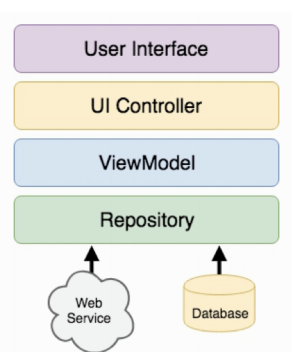

# Platform based programming, 2020

Author: Jakob Marušič

- [Platform based programming, 2020](#platform-based-programming-2020)
- [1. Overview of platforms](#1-overview-of-platforms)
  - [1.1 What is platform?](#11-what-is-platform)
    - [Abstraction levels of platform](#abstraction-levels-of-platform)
    - [Platform breakdown](#platform-breakdown)
  - [1.2 Web platforms](#12-web-platforms)
    - [History](#history)
    - [HTTP's properties](#https-properties)
    - [Web platform evolution](#web-platform-evolution)
    - [2020 standard - MEAN architecture](#2020-standard---mean-architecture)
    - [REST - Representational State Transfer](#rest---representational-state-transfer)
    - [Constraints of HTTP](#constraints-of-http)
  - [1.3 Mobile computing platforms](#13-mobile-computing-platforms)
    - [Mobile computer development timeline](#mobile-computer-development-timeline)
    - [Mobile operating systems](#mobile-operating-systems)
    - [Constraints](#constraints)
  - [1.4 Embedded systems](#14-embedded-systems)
    - [Constraints](#constraints-1)
- [2. Embedded systems](#2-embedded-systems)
  - [2.1 Conversions](#21-conversions)
    - [2.1.1 Analogue to Digital (ADC)](#211-analogue-to-digital-adc)
    - [2.1.2 Digital to Analogue (DAC)](#212-digital-to-analogue-dac)
  - [2.2 Programming MCU](#22-programming-mcu)
  - [3. Arduino programming](#3-arduino-programming)
  - [3.1 Digital vs. Analogue Pins](#31-digital-vs-analogue-pins)
  - [3.2 Sketches](#32-sketches)
    - [3.2.1 Programming I/O](#321-programming-io)
    - [3.2.2 Arduino Library Functions](#322-arduino-library-functions)
  - [3.3 Interupts](#33-interupts)
  - [3.4 Arduino Cross-Compilation](#34-arduino-cross-compilation)
- [4. Mobile Platform Programming](#4-mobile-platform-programming)
  - [4.1 Constraints & challenges](#41-constraints--challenges)
- [5. Android programming](#5-android-programming)
  - [5.1 Architecture](#51-architecture)
    - [5.1.1 Key Android Features](#511-key-android-features)
    - [5.1.2 Linux Karnel Services](#512-linux-karnel-services)
    - [5.1.3 Native Libraries](#513-native-libraries)
    - [5.1.4 Android Runtime](#514-android-runtime)
    - [5.1.5 Application framework](#515-application-framework)
  - [5.2 Basic application components](#52-basic-application-components)
  - [5.3 Activity Lifecycle](#53-activity-lifecycle)
    - [5.3.1 `onCreate`](#531-oncreate)
    - [5.3.2 `onStart`](#532-onstart)
    - [5.3.3 `onRestart`](#533-onrestart)
    - [5.3.4 `onResume`](#534-onresume)
    - [5.3.5 `onPause`](#535-onpause)
    - [5.3.6 `onStop`](#536-onstop)
    - [5.3.7 `onDestroy`](#537-ondestroy)
    - [5.3.8 Placing App Functionalities](#538-placing-app-functionalities)
    - [5.3.9 Saving Activity State](#539-saving-activity-state)
  - [5.4 Starting activity (Intent, Task)](#54-starting-activity-intent-task)
    - [5.4.1 Task](#541-task)
    - [5.4.2 Intent](#542-intent)
      - [Specifying IntentFilters](#specifying-intentfilters)
  - [5.5 Android UI](#55-android-ui)
    - [5.5.1 View](#551-view)
    - [5.5.2 Fragments](#552-fragments)
    - [5.5.3 Material design](#553-material-design)
      - [Navigator drawer](#navigator-drawer)
  - [5.6 Data Storage](#56-data-storage)
    - [5.6.1 SharedPreferences](#561-sharedpreferences)
    - [5.6.2 File Storage](#562-file-storage)
    - [5.6.3 SQLite](#563-sqlite)
  - [5.7 Permissions](#57-permissions)
  - [5.8 Notifications](#58-notifications)
  - [5.9 Background Processing](#59-background-processing)
    - [5.9.1 Java Threads and Handlers](#591-java-threads-and-handlers)
    - [5.9.2 Services](#592-services)
    - [5.9.3 Broadcast](#593-broadcast)
    - [5.9.4 IntentService](#594-intentservice)
      - [Invoking IntentService](#invoking-intentservice)
      - [Handling results](#handling-results)
    - [5.9.5 AsyncTask _(deprecated)_](#595-asynctask-deprecated)
    - [5.9.6 Periodic/Occasional Task Scheduling](#596-periodicoccasional-task-scheduling)
      - [Wake Lock](#wake-lock)
      - [AlarmManager](#alarmmanager)
    - [5.9.7 Doze Mode](#597-doze-mode)
    - [5.9.8 WorkManager](#598-workmanager)
    - [5.9.9 Conclusion - when to use what?](#599-conclusion---when-to-use-what)
  - [5.10 Mobile Sensing](#510-mobile-sensing)
    - [5.10.1 Sensor Framework](#5101-sensor-framework)
    - [5.10.2 Google Play Services](#5102-google-play-services)
  - [5.11 Mobile Sensing and Machine Learning](#511-mobile-sensing-and-machine-learning)
    - [5.11.1 Supervised learning](#5111-supervised-learning)
      - [Evaluating classification](#evaluating-classification)
    - [5.11.2 Naive Bayesian Classifier](#5112-naive-bayesian-classifier)
  - [5.12 Android Architeture Components](#512-android-architeture-components)
    - [5.12.1 Model-View-Controller (MVC)](#5121-model-view-controller-mvc)
    - [5.12.2 Model-View-ViewModel (MVVM)](#5122-model-view-viewmodel-mvvm)
      - [ViewModel Class](#viewmodel-class)
      - [LiveData Class](#livedata-class)
      - [Data Binding](#data-binding)
  - [5.13 Managing Data Flow & Object-relational Mapping](#513-managing-data-flow--object-relational-mapping)
    - [5.13.1 Room Databse](#5131-room-databse)
    - [5.13.2 Entities](#5132-entities)
    - [5.13.3 Data Access Object (DAO)](#5133-data-access-object-dao)
    - [5.13.4 Database Instance](#5134-database-instance)
    - [5.13.5 Practical Considerations](#5135-practical-considerations)
  - [5.14 Network Communication](#514-network-communication)
    - [5.14.1 Wireless Data Transmission](#5141-wireless-data-transmission)
    - [5.14.2 Web abstraction](#5142-web-abstraction)
    - [5.14.3 Best Practices in Android Networking](#5143-best-practices-in-android-networking)
    - [5.14.4 Backend for Mobile Apps](#5144-backend-for-mobile-apps)
  - [5.15 Hybrid Application Development](#515-hybrid-application-development)
    - [5.15.1 Apache Cordova](#5151-apache-cordova)

# 1. Overview of platforms

## 1.1 What is platform?

**Platform is the environment in which a software application is executed.**

**Environment** = hardware and/or software (e.g. computer architecture, operating systems, APIs, programming frameworks etc.).

### Abstraction levels of platform

_From "32-bit platform" to "Platform-as-a-service_

1. **Hardware level** - processing capabilities, IO capabilities
2. **Middleware level** - drivers, operating systems
3. **Higher level** - APIs, Cloud, etc.

### Platform breakdown

- web platforms
- mobile platforms
- industrial/embedded platforms
- gaming platforms

## 1.2 Web platforms

> **The Web is not equal to The Internet**
> Web is most popular service running on top of the internet.

### History

In 1989 Tim Berners-Lee joins hypertext with internet to create **the World Wide Web**, _Hypertext_ is text document with references that can be immediately accessed.

WWW creates a global information space, storage is implemented via **web servers**, hypertext documents are written in **HTML** and communcation is done over internet with client-server protocol **Hyper Transfer Protocol HTTP**.

### HTTP's properties

HTTP uses **request-response** client-server protocol. Web browser (client) issues request and web server sends response (requests: GET, POST, PUT, DELETE, etc). For resource locators are used **URLs** (uniform resource locators) - URLs are translated to IP address using DNS (domain name system).

HTTP is **stateless** protocol, for saving states cookies are used.

HTTPS is used for encrypted communication.

### Web platform evolution

1. **Single-tier architecture** - user interface, business logic and data are all within the same programme
2. **Multi-tier architecture** - different layer for presentation, logic and data. Better for scaling and upgrading, layers are more flexible

| Layer                                | Environment & language                 |                                                            |
| ------------------------------------ | -------------------------------------- | ---------------------------------------------------------- |
| Presentation layer (frontend)        | HTML5, JS, CSS                         | dealing with UI, user iteractions                          |
| Application/Business layer (backend) | Java, .Net, Python, Rust, etc.         | dealing with app logic, data fetching, processing, etc.    |
| Data layer                           | MySQL, Oracle, PostgreSQL, MsSQL, etc. | deealing with data storage and organization (SQL vs NoSQL) |

### 2020 standard - MEAN architecture

> M - MongoDB (database)\
> E - ExpressJS (server, backend)\
> A - Angular (JS framework, frontend)\
> N - Node.js (event-driven server-side and networking)

Constraints: MongoDB is NoSQL (BASE transactions)

### REST - Representational State Transfer

Rules:

- client-server model: black box to each other
- statelessness: server doesn't track state of client
- cacheability
- layered system
- uniform interface

Constraints: **Statelessness** - client needs to send context, in practise developers implements their own solutions (adding headers, etc.)

### Constraints of HTTP

- **Expressivity of the HTTP vocabulary** - can you accomplish everything with GET, POST, PUT, DELETE?
- **Keep-Alive connection** - uses memory and other resources
- **Non secure by default**

## 1.3 Mobile computing platforms

### Mobile computer development timeline

| Year      |                                                                        |
| --------- | ---------------------------------------------------------------------- |
| 1994      | **IBM Simon** - first _"smartphone"_ - celluar + email + faxing + apps |
| late '90  | **PDA** (personal digital assistant) - early versions of mobile OS     |
| early '00 | mass adoption (BlackBerry)                                             |
| 2007      | **iPhone**                                                             |
| 2008      | **Android OS**                                                         |
| today     | more than 1 bilion users                                               |

### Mobile operating systems

1. **Symbian** - started in 1998, used by Nokia, Samsung, Sony Ericsson, etc., very resource efficient
2. **iOS** - specific hardware
3. **Android** - open source, based on Linux

### Constraints

- **Energy**
- **Processing** - background processing is limited to minimize energy use
- **Wireless connectivity**
- **User interaction (responsiveness)**, uniform user experience

## 1.4 Embedded systems

Computer systems are often (98%) embedded in everyday objects. Today arround 100 bilion microcontrollers compared to 5 bilion smartphones and 2 bilion PCs.

Embedded systems are very **constrained systems** (energy, autonomous operation, real-time operation, etc.). They interact with environment through sensors, react to it through actuator and communicate via wireless.

Embedded systems are programmed in low-level languages, C, C++ or assembler. They are event-driven.
Low priority tasks are executed in an infinite loop, high priority events are executed via interrupt routine.

They can have real-time OS, specific purpose OS or none (only bootloader).

### Constraints

- **Hardware-aware development**
- **Limited resources**
- Deploy and forget
- **Extreme energy efficiency**

# 2. Embedded systems

Goal of embedded systems is having working application that works efficiently (cost critical, safety critical, resource efficient).


**Intellctual property core (IP Core)** - reusable logic or a unit of functionality (eg. network controller).

**Field-Programmable Gate Array (FPGA)** - reconfigurable integrated circuit that contains an array of programmable logic blocks. Programmed to perform a specific functionality.

**Microcontroller Unit (MCU)** - scaled-down microprocessor (smaller, less processing power), connected to other components, sends commands and receives data.

**Sensors** - measure and detect physical properties and convert them to electric signals.

**Actuators** - cause events to occur in the environment, driven by signal from system, often require extra power to operate (screen, motor, LEDs, etc.).

## 2.1 Conversions

### 2.1.1 Analogue to Digital (ADC)

Analogue input (ussualy from sensor) and digital output (limited numbers of bits -> quantization error).

ADC sampling rate - how frequently does the conversion happen?

### 2.1.2 Digital to Analogue (DAC)

Digital input (usually from processing part of system) and analog output (usually at an actuator). Boards like Arduino ussualy don't have built-in DAC.

## 2.2 Programming MCU

MCU are programmed via cross-compilation (programmed on PC, transfered to MCU).

**Toolchain** - a set of tools need to perform a software development task.


**Process** - an abstraction encapsulating a set of processing tasks:

- instructions
- resources assigned to it
- context - processor state while the process is being executed


## 3. Arduino programming

## 3.1 Digital vs. Analogue Pins

Digital I/O pins - read&write digital input(low or high), output (0V or 5V).

Analogue I/O pins - read analogue voltage (used for sensor interaction), pin is connected to ADC (resolution is 10 bits).

## 3.2 Sketches

**Sketch** is arduino programme usually written in C, contains _setup()_, _loop()_ (but no _main()_).

### 3.2.1 Programming I/O

Mode setting (Pin: 0-13 digital, A0-A5 analogue; Mode: INPUT, OUTPUT, INPUT_PULLUP)

```c
void pinMode(pin, mode);
```

Digital input - returns state of digital pin (LOW/HIGH)

```c
int digitalRead(pin)
```

Digital output

```c
void digitalWrite(pin, value)
```

Analogue input (returns from 0 to 1023)

```c
int analogueRead(pin)
```

Analogue write (value from 0 to 255)

```c
void analogWrite(pin, value)
```

### 3.2.2 Arduino Library Functions

```c
void delay(val) // pauses programme for val milliseconds
long millis() // returns number of milliseconds since programme started
void tone(pin, frequency, duration) //generate square wave of specified frequency
```

## 3.3 Interupts

Signals telling the MCU that there is an event requiring immediate attention.

````c
//react when pin experiences ```mode(change)``` by firing the ISR
attachInterrupt(digitalPinToInterrupt(pin), ISR, mode)

//pin no longer reacts to interrupts
detachInterrupt(digitalPinToInterrupt(pin))

noInterrupts()
interrupts()
````

## 3.4 Arduino Cross-Compilation

**avr-gcc** is invoked to cross-compile the code:

- AVR - microcontroller family
- GCC - C/C++ compiler
- generates an object file (.o)
- links object file with Arduino library files
- result is .elf file

**avr-objcopy** is invoked to change the format of exec from `.elf` to `.hex` that board understands

**avrdude** uploads the code to the board

# 4. Mobile Platform Programming

## 4.1 Constraints & challenges

- energy
- processing constraints: app gets only small share of the total resources
- user iteraction constraints: interactions should be intuitive and responsive despite limitations
- uniform user experience: app should support a range of devices
- wireless constraints
- context sensing challenges: inconsistent sensors, raw data has to be processed to use on high-level
- security & privacy

# 5. Android programming

## 5.1 Architecture

**The android platform** contains: Android mobile OS, Android libraries (androidx, support libraries, 3rd party,...), applications frameworks and key apps.

### 5.1.1 Key Android Features

1. **Tailored for battery-powered devices** - process managment, when app is not used is gets suspended
2. **Tailored for low-memory devices** - when memory is low, suspended apps are terminated
3. **Support for direct manipulation interfaces** - touchscreen gestures, sensors, notifications
4. **Open ecosystem for applications**


### 5.1.2 Linux Karnel Services

1. **Memory and process managment**
   - usually one process per app,
   - process has allocated certain amount of memory
   - Android automatically manages process lifecycle
   - interprocess communication
2. **Security managment**
   - base on Security-Enhanced Linux
   - only karnel and few apps runs as root
   - each app has unique UID and runs in sandbox
   - each app gets set of permissions (permissions can be restricted by user)
3. **Power managment**
   - screen diming, process killing
   - wakelocks (preventing device from going to sleep)
   - _Project Volta_ - OS takes care of scheduling periodic jobs for the apps
4. **File&network I/O**
5. **Devices drivers**

### 5.1.3 Native Libraries

- system C library
- surface manager (composing windows on the screen)
- open GL
- openMAX (audio, video, image processing)
- media framework (recording&playback of audio, video, photos)
- SQLite
- Webkit
- Neural network API

### 5.1.4 Android Runtime

1. **ANdroid core libraries** - beside standard Java libraries
2. **Process virtual machine (VM)** - Dalvik/Android runtime

| Android runtime (ART)                                                                                       | Dalvik                              |
| ----------------------------------------------------------------------------------------------------------- | ----------------------------------- |
| when .apk is installed, ART uses ahead-of-time compilation to convert it and save it as native machine code | trace-base just-in-time compilation |

**Compilation and workflow (with Android Runtime)**:

1. App witten in Java/Kotlin
2. Compiled to Java bytecode _(.class file)_
3. DX converts Java bytecode to a single DEX bytecode file _(.dex file)_ optimised for space
4. _.apk_ file is generated with the dex file and all application resources, manifest, etc.

### 5.1.5 Application framework

1. **Package manager**:
   - keeps track of the installed applications
2. **Window manager**:
   - manages application's windows
3. **Content providers**:
   - applications are sandboxed
   - content provider manages acess data between applications
4. **Location manager**:
   - provides location and movement information
   - ways to access location info: directly through location manager or using Google Play Location Services (preferred)
5. **Notification manager**:
   - also allows to peek into other applications' notifications
6. **Resources manager**: Android application resources - non-compiled static content of application (images, music, etc.)
   - support for different screen sizes, orientations, languages, platform versions,...
7. **Activity manager**:
   - manages application lifecycle and navigation through the stack of applicaton pages taht a user sees
8. **View system** - for building app's user interface
   - defined by an XML file

## 5.2 Basic application components

1. **Activity** - has a graphical user interface (GUI)
2. **Service** - performs background processing
3. **BroadcastReceiver** - subscribes to events of interest
4. **Intent** - communicates an intention to perform an action
5. **CntentProvider** - encapsulates and exposes data

## 5.3 Activity Lifecycle

Activities are kept active only when user can iteracts with them, when not in use (in background) there are stopped. If OS needs resources activities may be destroyed.

**Activity state**

1. Active or running - in the foreground, visible and user can iteracts with them
2. Paused - lost focus, but still visible, maintains state and member information
3. Sopped - completely obscured by another activity, retains state and member information, however, no longer visible and it could be terminated by the OS

### 5.3.1 `onCreate`

Activity triggers:

```java
protected void onCreate(Bundle savedInstanceState)
```

`onCreate()` is called when activity is first created, it sets up initial state (create and configure views, set activity's content view, bind data, etc.). Method also gets Bundle with Activity's previous state.

### 5.3.2 `onStart`

Activity triggers:

```java
protected void onStart()
```

`onStart()` is called when activity becomes visible.

### 5.3.3 `onRestart`

Activity triggers:

```java
protected void onRestart()
```

`onRestart()` is called when activity is becoming visible, after being stopped. Will be followed by `onStart()` and `onResume()`.

### 5.3.4 `onResume`

Activity triggers:

```java
protected void onResume()
```

`onResume()` is called when activity is visible and is about to start iteracting with user. In it we start foreground-only activities (e.g. getting user location and show it on the map).

### 5.3.5 `onPause`

Activity triggers:

```java
protected void onPause()
```

`onPause()` is called when activity loses focus and another activity is about to start. We use it to commit unsaved changes to persist data, stop animations and CPU-intensive processing. Processing in this method should be done quickly, because next activity will not start until this method ends.

### 5.3.6 `onStop`

Activity triggers:

```java
protected void onStop()
```

`onStop()` is called when activity is no longer visible (because another activity is being started for example). We release resources that are not needed while the activity is not visible and we perform CPU-heavy shutdown operations. After this method still exists but is no longer connected to Window Manager.

### 5.3.7 `onDestroy`

Activity triggers:

```java
protected void onDestroy()
```

`onDestroy()` is called when activity is about to get destroyed (when `finish()` is called or when OS calls it). In it resources are released (such as Threads).

_It may not be called if Android kills application._

### 5.3.8 Placing App Functionalities

| Functionality                              | Method                      |
| ------------------------------------------ | --------------------------- |
| Instantiate member variables of the class  | `onCreate()`                |
| Register listener for events               | `onResume()` or `onStart()` |
| Unregister listeners for events            | `onPause()` or `onStop()`   |
| Kill threads that the activity has spawned | `onDestroy()`               |

### 5.3.9 Saving Activity State

`onSaveInstanceState()` is called when activity gets stopped in it we store state in Bundle. It is not part of the lifecycle. In a bundle we should store only "Light" values and not big objects.

Bundle is restored in `onRestoreInstanceState()` or in `onCreate()`.

## 5.4 Starting activity (Intent, Task)

To start activity we have to create Intent specifying activity to start, then we pass intent to one of the methods:

- `startActivity()` - launches activity described by the intent
- `startActivityForResult()` - we excpect result to be returned from started activity (via `setResult()`)

### 5.4.1 Task

**Task** is collection of Activities that users iteracts when performing certain job. Activities in task could be from the same application or not.

**Backstact** - activities are arranged in a stack in the order of creations. When launched activity is pushed on top of stacka nd when destroyed activity is popped of stack. In the backstack there can be more then one instance of same activity.

### 5.4.2 Intent

**Intent** is data structure that represents an operation to be performed or event that has occured. It serves as a glue between activities and it holds abstract description of an action to be performed.

Intent filds: action, data, category, type, component, extras.

**Action field** represents desired operation (e.g. _ACTION_DIAL_ dial number)

```java
Intent i = new Intent (Intent.ACTION_DIAL);
```

**Data field** is formated like URI (e.g. `Uri.parse("content://contacts/people/1")` contact of a person 1)

```java
Intent newIntent = new Intent(Intent.ACTION_VIEW, Uri.Parse("geo:0,0?q=Ljubljana, Slovenia, 1000"))
```

**Category field** - gives additional information about component that handles intent (e.g. CATEGORY_BROWSABLE can be invoked by browser).

**Type field** - specifies MIME (internet standard) type of intent data (e.g. `image/*`, `image/png`) .

**Component filed** - specifies explicit name of component class to use in intent. If component field is set then the implicit matching is skipped, and the specified component is launched. In this case all of the other Intent attributes become optional.

**Extras field** - Bundle of additional information associated with intent.

```java
Intent i = new Intent(Intent.ACTION_SEND);
i.putExtra(String name, String value);
```

#### Specifying IntentFilters

Setting activity to handle sending text and media

```xml
<activity android:name="ShareActivity">
<!-- This activity also handles "SEND" and "SEND_MULTIPLE" with media data -->
    <intent-filter>
        <action android:name="android.intent.action.SEND"/>
        <action android:name="android.intent.action.SEND_MULTIPLE"/>
        <category android:name="android.intent.category.DEFAULT"/>
        <data android:mimeType="application/vnd.google.panorama360+jpg"/>
        <data android:mimeType="image/*"/>
        <data android:mimeType="video/*"/>
    </intent-filter>
</activity>
```

## 5.5 Android UI

### 5.5.1 View

View is the main class on which the View System operates, it is responsible for drawing itself and handlign events. From View we derive other UI objects (button, edittext, mapview,...). View and its derived classes can be instantiated through XML code or Java source code.

**AdapterViews** - separation between data and child views. Adapter manages data and provides it to views. (example ListView).

**View events** - stem for user iteraction and lifecycle changes. Listeners are used for handling View events (`OnClickListener.onClick()`).

```java
protected void onCreate(Bundle savedValues) {
    ...
    // Capture our button from layout
    Button button = (Button)findViewById(R.id.button);
    // Register the onClick listener with the implementation above
    button.setOnClickListener(mListener);
    ...
}

private OnClickListener mListener = new OnClickListener() {
    public void onClick(View v) {
    // do something when the button is clicked
    }
};
```

### 5.5.2 Fragments

Main purpose of fragments is to support more dynamic and flexible UI designs and UI element reusability. Fragment has layout and lifecycle, but unlike activity, fragment needs parent activity, doesn't need to be the only fragment on the screen and doesn't talk directly to other fragments.

In fragment we can access context or parent activity through `getContext()` or `getActivity()`. Activity can access fragment via FragmentManager `findFragmentByID()` or `findFragmentByTag()`.

```xml
<LinearLayout
    xmlns:android="http://schemas.android.com/apk/res/android"
    android:orientation="horizontal"
    android:layout_width="match_parent"
    android:layout_height="match_parent">
        <fragment android:name="com.example.news.ArticleListFragment"
            android:id="@+id/list"
            android:layout_weight="1"
            android:layout_width="0dp"
            android:layout_height="match_parent" />
        <fragment android:name="com.example.news.ArticleReaderFragment"
            android:id="@+id/viewer"
            android:layout_weight="2"
            android:layout_width="0dp"
            android:layout_height="match_parent" />
</LinearLayout>
```

```java
FragmentManager fragmentManager = getSupportFragmentManager();
FragmentTransaction fragmentTransaction = fragmentManager.beginTransaction();
ExampleFragment fragment = new ExampleFragment();
fragmentTransaction.add(R.id.fragment_container, fragment);
fragmentTransaction.commit();
```

### 5.5.3 Material design

Guidelines for designing UI components, it is a design library that has to be included as a dependency in module. It includes components like CoordinatorLayout, BottomSheet, FloatingActionBar, Tabs, etc.

#### Navigator drawer

Navigation drawer includes:

- **main layout** that is shown when the drawer is pulled in
- **NavigationView** that is shown when the drawer is pulled out

```xml
<androidx.drawerlayout.widget.DrawerLayout …>
    <include
        layout="@layout/some_main_layout"
        android:layout_width="match_parent"
        android:layout_height="match_parent" />
    <com.google.android.material.navigation.NavigationView
        android:id="@+id/nav_view"
        android:layout_width="wrap_content"
        android:layout_height="match_parent"
        android:layout_gravity="start"
        android:fitsSystemWindows="true"
        app:headerLayout="@layout/nav_header"
        app:menu="@menu/navigation_menu" />
</androidx.drawerlayout.widget.DrawerLayout>
```

`ActionBarDrawerToggle` defines how the ActionBar and DrawerLayout will iteracts, it also detects when drawer is opened or closed.

**Fragment navigation with navigation drawer** -first child should be a placeholder for fragments (usually FrameLayout). NavigationView's `onNavigationItemSelected()` should:

1. create new fragment
2. call FragmentManager that begins transaction to replace content of the placeholder
3. transactions has to be commited

## 5.6 Data Storage

### 5.6.1 SharedPreferences

In SharedPreferences we store small amount of primitive type. Data is stored on device in **key-value pairs** and only app that creates it can access it. When app is unistalled from device, SharedPreferences are deleted from device.

Common use: user preferences (usename, customization, etc.), some logic variables (is app launched for the first time, etc.).

**Writing data**

```java
SharedPreferences settings = getApplicationContext().getSharedPreferences("preferences", MODE_PRIVATE);
SharedPreferences.Editor editor = settings.edit();
editor.putBoolean("launched", true);
editor.commit();
```

`commit()` - synchronous or `apply()` changes in-memory object immediatly, but writes on disk asynchronously (better to use it in main thread then commit).

**Reading data**

```java
SharedPreferences settings = getApplicationContext().getSharedPreferences("preferences", MODE_PRIVATE);
boolean wasLaunched = settings.getBoolean("launched", false);
```

### 5.6.2 File Storage

Android uses common Java File API, that means that files can be saved as internal or external files

| Internal files                                              | External files                                                 |
| ----------------------------------------------------------- | -------------------------------------------------------------- |
| Part of non-removable storage that is not shared among apps | Removable or non-removable storage that is shared among apps   |
| Always available                                            | Not always available (can be stored to external, USB, storage) |
| By default, only accessible by app that created it          | world-readable                                                 |
| When app is unistalled, files are deleted                   |                                                                |

```java
// Internal
File file = new File(context.getExternalFilesDir(
        Environment.DIRECTORY_PICTURES), albumName
    );

// External
File file = new File(Environment.getExternalStoragePublicDirectory(
        Environment.DIRECTORY_PICTURES),albumName
    );
```

### 5.6.3 SQLite

Relational database kept in a single file (write operation gets exclusive lock over app) that supports ACID transactions (Atomic, Consistent, Isolated and Durable).

Use SQLite when SQL queries can be used for improved data presentation. Database will be removed after app is unistalled.

## 5.7 Permissions

Android apps are sandboxed with unique user ID and group ID. By default only most basic functionalities are available to an application, other have to be explicitly asked for.

Permissions are declared in ˙AndroidManifest.xml`.

```xml
<uses-permission android:name="android.permission.ACCESS_FINE_LOCATION"/>
```

Normal permissions like FLASHLIGHT, VIBRATE, BLUETOOTH will be automatically granted by OS. For more dangerous permissions (like READ_CONTACTS, SEND_SMS, etc.) the OS will explicitly ask user to grant access.

**Custom permissions** can be added to application if application performs privileged/dangerous function.

```xml
<permission android:name="com.testpackage.mypermission"
android:label="my_permission"
android:protectionLevel="dangerous"/>
```

Any app that calls this app has to request `"com.testpackage.mypermission"`.

**Permission design**

- do not request permissions unless permission is needed
- show immediate benefit of granting permision
- use intents to call other app in case you don't need to handle functionaity within app

## 5.8 Notifications

Notifications are managed via `NotificationManager` (or, preferably, via `NotificationManagerCompat`), notification is posted via `notify()` and clered via `cancel()` and `cancelAll()`.

```java
notification = new NotificationCompat.Builder(this)
    .setContentTitle(notificationTitle)
    .setContentText(notificationText)
    .setSmallIcon(R.drawable.icon)
    .setContentIntent(pendingIntent).build();
```

## 5.9 Background Processing

**UI (Main) Thread** is created and started when application is launched - loops infinetely and listens for events on UI components. Intensive work can prevent UI thread from processing UI interaction tasks. That is why heavy/slow operations should be run in background threads.

### 5.9.1 Java Threads and Handlers

The most general method. Straightforward solution - create worker Thread, put infinite loop in it and listen for new tasks. Each task is executed and result is reported back to the UI Thread via a _Handler_. If loop is broken, thread is killed.

**Looper** keeps thread alive in an infinite loop (automatically created for UI thread).

**MessageQueue** hold Messages/Runnables for thread (message for passing data to thread, runnable - task that is executed when thread is free)

**Handler** associated with particular thread and allows sending messages/runnables to the MessageQueue and process them.


### 5.9.2 Services

Activities runon main (UI) thread and have UI attached. Services can run on either main or separated threads and don't have UI attached. Services are more independent then threads and they run even after Activity is destroyed.

**Background services** for actions that do not have to be noticed by the user. **Foreground services** are actions that user needs to be aware of and should have control of (e.g. music player app). Foreground service must show a notification.


**Bound Services** are like servers in client-server paradigm, they are started through binding and they return IBinder object. Services remains running as long as connection is established.

### 5.9.3 Broadcast

Broadcasts allows messages (warpped in Intents) to be sent from other components of app, other apps or from Android system.

```java
Intent intent = new Intent();
intent.setAction(ACTION);
intent.putExtra(STOP_SERVICE_BROADCAST_KEY, RQS_STOP_SERVICE);
sendBroadcast(intent);
```

Broadcasts are captured in an app/component if BroadcastReceiver is registered in the code.

```java
public class NotifyServiceReceiver extends BroadcastReceiver{
    @Override
    public void onReceive(Context arg0, Intent arg1) {
        …
    }
}
```

You can register for receiving only certain kinds of Intents:

```java
IntentFilter intentFilter = new IntentFilter();
intentFilter.addAction(ACTION);
registerReceiver(notifyServiceReceiver, intentFilter);
```

Broadcast receiver should also be registered in `AndroidManifest.xml`, then `onReceive()` is implmented in code:

```xml
<receiver android:name=".MyBroadcastReceiver" android:exported="true">
    <intent-filter>
        <action android:name="android.intent.action.BOOT_COMPLETED"/>
        <action android:name="android.intent.action.INPUT_METHOD_CHANGED"/>
    </intent-filter>
</receiver>
```

```java
public class MyBroadcastReceiver extends BroadcastReceiver {
    @Override
    public void onReceive(Context context, Intent intent) {

    }
}
```

### 5.9.4 IntentService

**IntentService** is Service that runs on separated thread and queues up requests and processes them one by one. It is suitable for _long running one-off tasks_ when programmer doesn't want to affect UI responsiveness. IntentService survives Activity lifecycle changes and is called using explicit Intent (started on demand, stopped when it runs out of work).

1. IntentService should be defined in `AndroidManifest.xml`:

```xml
<service
    android:name=".FetchAddressIntentService"
    android:exported="false"/>
```

2. Class where IntentService is used should be extended with `IntentService`:

```java
public class FetchAddressIntentService extends IntentService {}
```

#### Invoking IntentService

IntentService is created with explicit Intent and started using `startService()`. Additional data can be added using extra field.

#### Handling results

To handle results `BroadcastReceiver` has to be implemented in Activity (with `onReceive()`)

```java
class AddressResultReceiver extends ResultReceiver {
    public AddressResultReceiver(Handler handler) {
        super(handler);
    }

    @Override
    protected void onReceiveResult(int resultCode, Bundle resultData)
    {…}
}
```

`ResultReceiver` is passed through Intent when IntentService is started:

```java
Intent intent = new Intent(this, FetchAddressIntentService.class);
intent.putExtra(Constants.RECEIVER, mResultReceiver);
intent.putExtra(Constants.LOCATION_DATA_EXTRA, mLastLocation);
startService(intent);
```

Then, in IntentService, result is set using Bundle and sended using `send()` method:

```java
Bundle bundle = new Bundle();
bundle.putString(Constants.RESULT_DATA_KEY, message);
mReceiver.send(resultCode, bundle);
```

### 5.9.5 AsyncTask _(deprecated)_

**AsyncTasks** are used for short and more interactive tasks, it is runned on separated worker thread, but keeps link with main UI thread via: `onPreExecute`, `onProgressUpdate` and `onPostExecute` (`AsyncTask<?, ?, ?>`, paramethers for input, progress and output). Background task is defined in `doInBackground()` and started with `Task().execute`.

```java
private class PostTask extends AsyncTask<String, Integer, String> {

    // executed just before tasks starts
    @Override
    protected void onPreExecute() {
        super.onPreExecute();
        ProgressBar bar=(ProgressBar)findViewById(R.id.progressBar);
        bar.setVisibility(View.VISIBLE);
        bar.setProgress(0);
    }

    //executed in background, status is communicated via publishProgress()
    @Override
    protected String doInBackground(String... params) {
        String url=params[0];
        for (int i = 0; i <= 10; i += 1) {
            try {
                Thread.sleep(1000);
            } catch (InterruptedException e) {
                e.printStackTrace();
            }
            publishProgress(i);
        }
        return "All Done!";
    }

    // connected to main thread
    @Override
    protected void onProgressUpdate(Integer... values) {
        super.onProgressUpdate(values);
        ProgressBar bar=(ProgressBar)findViewById(R.id.progressBar);
        bar.setVisibility(View.VISIBLE);
        bar.setProgress(values[0]);
    }

    // executed after task is finnished
    @Override
    protected void onPostExecute(String result) {
        super.onPostExecute(result);
        ProgressBar bar=(ProgressBar)findViewById(R.id.progressBar);
        bar.setVisibility(View.GONE);
        TextView text = (TextView) findViewById(R.id.status);
        text.setText(R.string.after);
    }
}
```

### 5.9.6 Periodic/Occasional Task Scheduling

**Contraints:** limited battery capacity (long and frequent background processing is main reason for inefficient energy use). That is why Android limits and controls background processing via _wake lock, foreground service, AlarmManager, WorkManager (JobScheduler++), DwonloadManager, SyncAdapter_.

#### Wake Lock

App prevents phone from going to a low-power sleep mode, to use it app has to have special permission:

```xml
<uses-permission android:name="android.permission.WAKE_LOCK" />
```

Wake Lock is created using:

```java
PowerManager powerManager = (PowerManager) getSystemService(POWER_SERVICE);
//PARTIAL_WAKE_LOCK doesn't prevent screen for going black, FLAG_KEEP_SCREEN_ON does
WakeLock wakeLock = powerManager.newWakeLock(PowerManager.PARTIAL_WAKE_LOCK, "MyApp::MyWakelockTag");
wakeLock.acquire();
```

And released using:

```java
wakelock.release();
```

#### AlarmManager

AlarmManager is used for running periodic operations at specified times or with specified time interval, used it for tasks that need to be done with exact times between them, but don't used for: periodic backup to the server (use SyncAdapter), checking for new notifications/messages from serve (use Firebase messaging if possible).

There are several types of alarms (depending on exactness):

- **inexact** - Android will decide how to group alarms coming from multiple apps in order to optimize energy use
- **exact** - alarm will be executed at prescribed time, unless device is in sleep mode
- **exact while idle** - alarm will be executed at prescribed time (+/- 9 minutes), even if device is in sleep mode

Alarm types (depending on clock):

- **RTC** - real time clock
- **ELAPSED_REALTIME** - time since booted

To use AlarmManager firstly you need to create `BroadcastReceiver` that manges task you want to perform when alarm is ready. Then you set an alarm with defined type (exact/inexact, one off/repeating, RTC/ELAPSED), starting time, repeating interval (optionally) and supplying Intent that starts BroadcastReceiver.

After device is rebooted, alarm has to be restored:

1. App has to have necessary permission

```xml
<uses-permission android:name="android.permission.RECEIVE_BOOT_COMPLETED"/>
```

2. App has to create receiver:

```java
public class SampleBootReceiver extends BroadcastReceiver {
    @Override
    public void onReceive(Context context, Intent intent) {
        if (intent.getAction().equals("android.intent.action.BOOT_COMPLETED")) {
        // Set the alarm here.
        }
    }
}
```

3. Receiver has to be registered in manifest

```xml
<receiver android:name=".SampleBootReceiver">
    <intent-filter>
        <action android:name="android.intent.action.BOOT_COMPLETED"></action>
    </intent-filter>
</receiver>
```

### 5.9.7 Doze Mode

**Doze mode** is mode when device is not charging nor actively used. In this state system sleeps most of the time, but it performs periodic maintence periods when it wakes up and performs tasks from backlog. During sleep mode wake locks are ignored, network access is suspended, AlarmManager is deferred to later time, jobs are not scheduled, sync adapters do not run.

To program with Doze mode in mind use **Firebase cloud messaging (FCM)** for communication apps - high priority messages can wake device up, **WorkManager** for scheduling jobs or request to be exempt from Doze (use only for specific apps).

To test apps in Doze mode force device/emulator to idle mode:

```
adb shell dumpsys deviceidle force-idle
```


### 5.9.8 WorkManager

**WorkManager** guarantees deferrable, constraint-aware execution with respect to system restrictions. Worker is unit of work

```java
public class UploadWorker extends Worker {
    public UploadWorker(
        @NonNull Context context,
        @NonNull WorkerParameters params) {
        super(context, params);
    }

    // by default runs in background thread
    @Override
    public Result doWork() {
        // Do the work here, e.g. upload the images.
        uploadImages()
        // Indicate whether the task finished successfully
        return Result.success()
    }
}
```

In _WorkRequest_ we set constraints, types of execution, e.g.:

```java
Constraints constraints = new Constraints.Builder()
    .setRequiresDeviceIdle(true)
    .setRequiresCharging(true)
    .build();

// ...then create a OneTimeWorkRequest that uses those constraints
OneTimeWorkRequest compressionWork = new OneTimeWorkRequest.Builder(CompressWorker.class)
    .setConstraints(constraints)
    .build();
```

We run tasks using:

```java
WorkManager.getInstance().enqueue(uploadWorkRequest);
```

### 5.9.9 Conclusion - when to use what?

| Type of work                                   | Example                                                               | What to use?                                                                                                                                       |
| ---------------------------------------------- | --------------------------------------------------------------------- | -------------------------------------------------------------------------------------------------------------------------------------------------- |
| Best effort execution                          | need to update UI, which may not be available                         | `HandlerThread`, `IntentService` or `AsyncTask`                                                                                                    |
| Guaranteed execution at current moment         | paying, we must ensure that payment goes through and user is informed | `ForegroundService`                                                                                                                                |
| Guaranteed eventual execution                  | Reminding user to exercise                                            | `WorkManager`                                                                                                                                      |
| Guaranteed execution at exact (periodic) times | Control oven through Android app                                      | Extremely difficult - make app exempt from battery optimization, use foreground service, use `AlarmManager` exact alarms (+/- 9 min), use Firebase |

**Specialised solutions for particular use cases**

| Use case                                      | Solution                             |
| --------------------------------------------- | ------------------------------------ |
| Synchronise data with server                  | `SyncAdapter`                        |
| Download large content in background          | `DownloadManager`                    |
| Reming user to buy milk when at grocery store | `Geofencing` from GooglePlayServices |

## 5.10 Mobile Sensing

| Pros of smartphone sensing                 | Cons of smartphone sensing                                                   |
| ------------------------------------------ | ---------------------------------------------------------------------------- |
| Personalised - suited for human activities | General purpose hardware, inappropriate placement leads to inacurate sensing |
| Low cost of deployment and maintence       | Multi-tasking OS                                                             |

| Mobile sensor                 | Use case                                            |
| ----------------------------- | --------------------------------------------------- |
| Accelerometer                 | physical activity (running, walking, sitting, etc.) |
| Aceelerometer, GPS, WiFi      | transport mode (bicycle, car, train)                |
| Microphone, camera, Bluetooth | surrondings, context (party, shopping mall)         |
| Microphone                    | human voice (speaker recognition, stress, etc.)     |

### 5.10.1 Sensor Framework

**SensorManager class** - system service for sensing managment, used for accelerometer, magnetometer, barometer, temperature sensor, light, proximity, etc. (before using sensor, check if sensor is present).

```java
private SensorManager sensorManager = (SensorManager) getSystemService(Context.SENSOR_SERVICE);
List<Sensor> deviceSensors = sensorManager.getSensorList(Sensor.TYPE_ALL);
```

- **Sensor class** - sensor types are constants, data reporting is either streamed or on changed
- **SensorEvent class** - events contains new sensed values, accuracy timestamp and sensor type information
- **SensorEventListener interface** - implement&override, then we register listener (at the end, we should unregister)

### 5.10.2 Google Play Services

**Google Play services** is background service providing access to a range of Google's services, like maps, Google sign in, Google drive, location, activity recognition, etc. It is centralised handler of sensing requests that reduces energy usage (e.g. one GPS result can be served to bunch of apps that request location in short period of time).

## 5.11 Mobile Sensing and Machine Learning

1. **Build mathematical models** explaining higher-level concept based on previously collected training data
2. **Predict/infer higher-level concepts** from newly-collected data using above models

**Types of machine learning (ML)**:

- supervised learning - training data contains both input valuesand output labels. Model is build to predict labels from future non-labelled data that contains only input
- unsupervised learning - training data contains unlabelled data. Model finds structure in data.


### 5.11.1 Supervised learning

**Classification** - the output (label) is catorical (e.g. walk, run, sit)
**Regression** - the output is numerical (e.g. predicting sleep time)

#### Evaluating classification

| Classification    |                                                                                           |
| ----------------- | ----------------------------------------------------------------------------------------- |
| True positive TP  | classifier predicts data point belongs to a class that indeed belogs to                   |
| True negative TN  | classifier predicts data point does not belong to a class that indeed does not belongs to |
| False positive FP | classifier predicts data point belongs to class, but it doesn't                           |
| False negative FN | classifier predicts data point doesn't belong to a class, but it does                     |

| Evaluating classification |                                         |
| ------------------------- | --------------------------------------- |
| Accuracy                  | $\frac{(TP + TN)}{(TP + TN + FP + FN)}$ |
| Precision                 | $\frac{TP}{(TP + FP)}$                  |
| Recall                    | $\frac{TP}{(TP + FN)}$                  |

| Evaluating regression     |                                                                                 |
| ------------------------- | ------------------------------------------------------------------------------- |
| Mean absolute error (MEA) |                                                                                 |
| Mean squared error (MSE)  |                                                                                 |
| $R^2$                     | how much better model is than simple horizontal line through mean of the sample |

### 5.11.2 Naive Bayesian Classifier

Based on Bayesian Theorem:
$$ P(Y|X) = \frac{P(X|Y)P(Y)}{P(X)} $$

$P(Y)$ - prior; $P(X)$ - evidence

$Y$ - class we observe; $X$ - features that we observe

**Example** - is person sleeping based on location, phone value, charging status (Y - sleping [yes, no], X1 - location (home, other), X2- volume [silent, ringing], X3 - charging [yes, no]).


## 5.12 Android Architeture Components

Intruduced in 2017 with new programming paradigms (from MVC (model-view-contoller) to MVVM (model-view-viewmodel)) and new classes/methods/libraries.

### 5.12.1 Model-View-Controller (MVC)


**Drawbacks**:

- controller and view are tigtly connected, if you change view, you have to change controller
- controller depends on user iteractions (activity)

### 5.12.2 Model-View-ViewModel (MVVM)


**Key points**:

- ViewModel is responsible for wrapping model and preparing observable data
- view binds to observable data invokes actions exposed by the ViewModel

#### ViewModel Class

| Problem                                                                                                                   | Solution                                                                                                           |
| ------------------------------------------------------------------------------------------------------------------------- | ------------------------------------------------------------------------------------------------------------------ |
| Handling data in Activity/Fragment - component may be destroyed, memory leaks, same data may be needed at different views | New class that survives activity/fragment lifecycle changes, provides data but it is not aware of views using data |

ViewModel is scoped to `ViewModelProvider`'slifecycle - survives activitiy `onDestroy()` calls, but not application's killed events. Data is in-memory, so not preserved on the long run.

We implement ViewModel using `AndroidViewModel` class.


| Pros of ViewModel                       | Cons of ViewModel                                            |
| --------------------------------------- | ------------------------------------------------------------ |
| Data survives screen orientatin changes | Views must query ViewModel to detect any changes in the data |
| Multiple views can use same ViewModel   |                                                              |
| No data leakage                         |                                                              |

#### LiveData Class

| Problem                                                                     | Solution                                                                              |
| --------------------------------------------------------------------------- | ------------------------------------------------------------------------------------- |
| Data is frequently updated, view must check for updates in an infinity loop | New class that holds data, allows data to be observed and notifies if data is changed |
| Views might want to update data in ViewModel                                |                                                                                       |

| Pros of LiveData class                                  | Cons of LiveData class                                                          |
| ------------------------------------------------------- | ------------------------------------------------------------------------------- |
| Data is updated frequently, observers to notify changes | Code still needs to be written to set and get view properties when data changes |

#### Data Binding

**Data binding library** allows data from ViewModel to be directly mapped to specific views in XML layout. Often is used in conjuction with `LiveData` from ViewModel.

**Using data binding**:

1. Modify `Gradle` file

```gradle
android {
    dataBinding {enabled = true}
}
```

2. Modify XML to have `<layout>` as root view
3. Add `<data>` variables in layot

```xml
<layout>
    <data>
        <variable
            name="myViewModel"
            type="si.uni_lj.fri.lrk.myapp.MainViewModel" />
    </data>
    <ConstraintLayout>...</ConstraintLayout>
    ...
</layout>
```

4. Binding classes are automatically generated
5. Instantiate binding class

```java
MainFragmentBinding binding;
binding = DataBindingUtil.inflate(inflater, R.layout.main_fragment, container, false);
```

6. Configure data binding variables

```java
binding.setVariable(viewModel, myViewModel)
```

7. Binding expressions - define how views interact with bound objects
   - _one way_ - view is updated with data from binding, but changes in view are not propagated to data
   - _two way_ - data is updated in response to changes in the view
   - _event and listener binding_

## 5.13 Managing Data Flow & Object-relational Mapping

Data can come from multiple sources (database, shared preferences, remote API, etc.). To handle data storing we use `Repository`.



**Problem** - object-oriented languages work with objects that can be complex, but relational databases store and manipulate simple scalar values in tables. Converting objects to table entries is cumbersome and prone to errors. **Solution** is using _Object-Relationa Mapping (ORM)_.

### 5.13.1 Room Databse

- **Data storage** - underlying Android SQLite database
- **Object files (Entities)** - annotated Java models
- **Data Access Object (DAO)** - interface between databse and Java objects

**Data flow**:

- repository gets room db instance, obtain references to DAO instances
- repository creates entity instances, passes them to the DAO
- repository calls methods on the DAO passing through entities to be inserted in the DB and receives entity instances back in response to search query
- when DAO has results it packages them into entity objects
- DAO interacts with room DB to initiate database operations and handle results
- room DB handles all low-level interactions with underlying SQLite DB, submitting queries and receiving results

### 5.13.2 Entities

Each DB table needs an associated Entity class that defines schema for the table. Entity class is a standard Java class with Room annotations:

```java
@Entity(tableName="customers"
public class Customer {
    @PrimaryKey(autoGenerate="true")
    @NonNull
    @ColumnInfo(name="customerId")
    private int id;

    @ColumnInfo(name="customerName")
    private String name;
}
```

### 5.13.3 Data Access Object (DAO)

DAO provides a way to access data stored within database. It is standard Java interface with additional annotations:

```java
@Dao
public interface CustomerDao {

    @Query("SELECT * FROM customers") //query that will be executed
    LiveData<List<Customer>> getAllCustomers();  //LiveData enables Repository to observe changes in the data
    …
}
```

### 5.13.4 Database Instance

Database instance is a helper class for accessing SQLite DB, it extends RoomDatabse and has additional annotations

```java
@Database(entities = {Customer.class}, version = 1)
public class CustomerRoomDatabase extends RoomDatabase {

    public abstract CustomerDao customerDao();
    private static CustomerRoomDatabase INSTANCE;

    static CustomerRoomDatabase getDatabase(final Context context) {
        if (INSTANCE == null) {
            synchronized (CustomerRoomDatabase.class) {
                if (INSTANCE == null) {
                    INSTANCE = Room.databaseBuilder(
                            context.getApplicationContext(),
                            CustomerRoomDatabase.class, "customer_database")
                        .build();
                }
            }
        }
        return INSTANCE;
    }
}
```

### 5.13.5 Practical Considerations

1. Running on the main thread is considered a bad practice and is disabled by default (enable with `allowMainThreadQueries()`), use Executors instead.
2. Repository should handle Database instantiation:

```java
public class CustomerRepository {
    private CustomerDao customerDao;
    private CustomerRoomDatabase db;

    public CustomerRepository(Application application) {
        db = CustomerRoomDatabase.getDatabase(application);
        customerDao = db.customerDao();
    }
    …
}
```

## 5.14 Network Communication

### 5.14.1 Wireless Data Transmission

Information is encoded as the variability of the electromagnetic fields. Waves are propagated from sender (Tx) to receiver (Rx). Basic paramethers of wireless data transmission are: _frequency, wavelength, bandwith_.

| Smartphone Wireless Interfaces       |                                                                               |
| ------------------------------------ | ----------------------------------------------------------------------------- |
| Near Field Communication (NFC)       | Very low power and short range (10cm), speed (400kbps), payment systems, etc. |
| Bluetooth/Bluetooth Low Energy (BLE) | Low power and short range (10m), speed (1Mbps)                                |
| WiFi                                 | Medium power consumption, relatively short range (100m), high speed           |
| Cellular network                     | Medium-high power consumption, long range, speed (40kbps 2G - 1Gbps 5G)       |

Wireless interface selection impacts:

- capabilities of your app
- cost for user
- power consumption

### 5.14.2 Web abstraction

**Http(s) URL Connection** - sends HTTP requests and optain responses using connection pooling. Responses are cached and secure communication is supported via Transport Layer Security (TLS).

**OkHttp** is advance HTTP client 3rd party library. It includes all functionalities of HttpsURLConnection, but also automatic network connection recovery, retries and data compresion.

**Retrofit** is REST client for Android (third-party library) that defines model, possible REST operations, converter, adapter, authentication mechanism and it builds client. Under the hood it uses OkHttp.

**Volley** is third-party REST client, compared to Retrofit it doesn't threat REST API calls as simple java methods so is more complex to write and has less response parsing options. But, compared to Retrofit, it does include support for image loading.

### 5.14.3 Best Practices in Android Networking

| Practise                           |                                                                |
| ---------------------------------- | -------------------------------------------------------------- |
| Run operatiopns on separate thread |                                                                |
| Reduce amount pf data transferred  | low resolution if possible, compress data, quering and caching |
| Push, don't pull                   | get notify when new data is available                          |
| Reuse network connections          | but don't leave them hanging forever                           |
| Secure data & connection           | SSL                                                            |
| Adapt to physical connection       | reduce data when on slow or metered network, prefetch data     |

### 5.14.4 Backend for Mobile Apps

**Firebase** is mobile and web development platform supported by Google that allows authentication with Google ID, notifications (chat-like apps), crashlytics, ML learning support, etc.

**Parse Server** is open source backend as service (BaaS), Back4App is its hosting platform. It is great for building REST APIs, scheduling server jobs, user managment (auto emails, social login).

**Back4App** includes NoSQL database, REST API to access data via HTTP using different languages/platforms.

## 5.15 Hybrid Application Development

Idea of **cross-platform software** is to write programme once and run it everywhere. Those are lightweight technologies that can run on different platforms (e.g. web apps written in HTML, JavaScript, CSS).

Drawbacks of cross-platform software are:

- features not supported by high-level methods cannot be used
- only lowest common denominator subset of features which are available on all platforms
- translating cross-platform programmes to individual native languages can lead to inefficiencies
- different platforms often have different user interface convections

Idea of **hybrid development** is to be able to access lower level features of individual platforms:

- lightweight technologies that can run on different platforms (e.g. HTML, JavaScript, CSS)
- libraries implementing access to internal functionalities of individual platforms
- pack into applications for individual platforms

### 5.15.1 Apache Cordova

Mobile hybrid app development framework in which apps are written using CSS, HTML and JavaScript. Some native functionalities are enabled through HTML5, but most of them are implemented using external plugins.


In Cordova you can capture and react to lifecycle events if needed, but you don't have to. Common events exposed by the application are:

- Device ready (app fully loaded)
- Application Pause
- Application Resume
- back button press
- menu button press
- start call button press
- etc.

```javascript
document.addEventListener("pause", callbackFion, false);
```

**Minimising drawbacks**:

- performance (compared to native apps): use minified versions of JS and CSS
- non-native look and feel: use CSS-based frameworks to create apps with native-like look and feel (e.g. Ionic, NativeScript)
